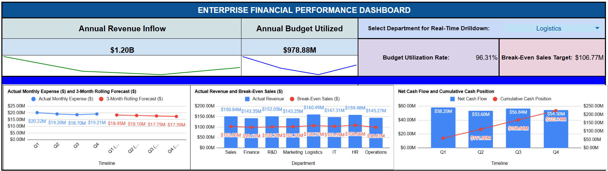
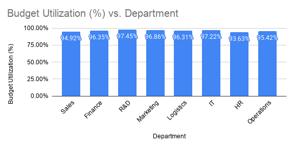
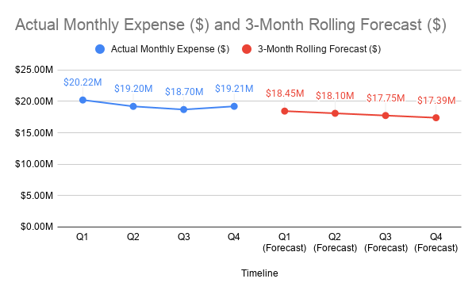
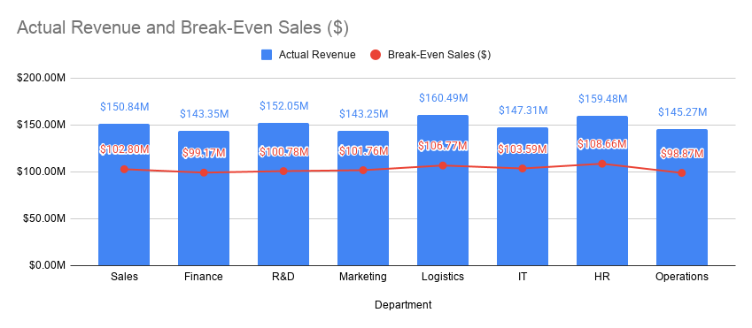

# Corporate FP&A Financial Model & Analytics Dashboard (Google Sheets)

## Project Overview

Built an interactive Google Sheets dashboard to analyze corporate financial performance, monitor budget utilization, track profitability, and evaluate cash flow trends. The goal was to identify budget variances, understand cost structures, and support strategic financial planning decisions.

**Dataset:** Financial Budget Optimization Dataset
**Source:** https://www.kaggle.com/datasets/colabsss/financial-budget-optimization-dataset

---

## Business Problem

The organization wants to understand:

* Which departments are utilizing budgets most efficiently?
* Which business units require the highest revenue to remain profitable?
* How are expenses trending over time?
* Is the company generating sufficient cash flow to support future growth?

---

## KPI Summary

| KPI                    |    Value |
| ---------------------- | -------: |
| Total Revenue          | $634.27M |
| Total Expenses         | $410.63M |
| Net Cash Flow          | $223.14M |
| Avg Budget Utilization |   95.43% |
| CAPEX Intensity Ratio  |   50.00% |

---

## Tools Used

* Google Sheets
* Charts
* SUMIFS
* VLOOKUP
* TREND
* SPARKLINE
* Data Validation
* Conditional Formatting

---

## Key Insights

* **R&D** recorded the highest budget utilization (**97.45%**), followed by **IT (97.22%)**.
* **HR** maintained the largest budget buffer with utilization of **93.63%**.
* **Logistics** generated the highest revenue (**$160.49M**) but required a high break-even threshold (**$106.77M**).
* Quarterly expense forecasts showed a decline from **$18.45M** to **$17.39M**, indicating improving cost efficiency.
* The company generated over **$53M–$58M** in quarterly net cash flow.
* Cumulative liquidity reached **$223.14M** by the end of Q4, demonstrating strong financial stability.

---

## Recommendations

* Increase contingency budgets for R&D and IT to reduce operational risk.
* Monitor high fixed-cost departments such as Logistics.
* Continue maintaining strong cash reserves for future expansion.
* Use forecast models to improve budgeting and resource allocation.

---

## Dashboard Features

* Budget Utilization Analysis
* Department Performance Analysis
* Break-Even Analysis
* Expense Forecasting
* Cash Flow Analysis
* CAPEX Analysis
* Interactive Department Filter

---

## Screenshots

### Executive Dashboard

### Variance Analysis

### Expense Forecasting

### Break-Even Analysis

---

## Project Information

- **Domain:** Corporate Finance / FP&A Analytics
- **Tool:** Google Sheets
- **Dataset Size:** 6,780 Records
